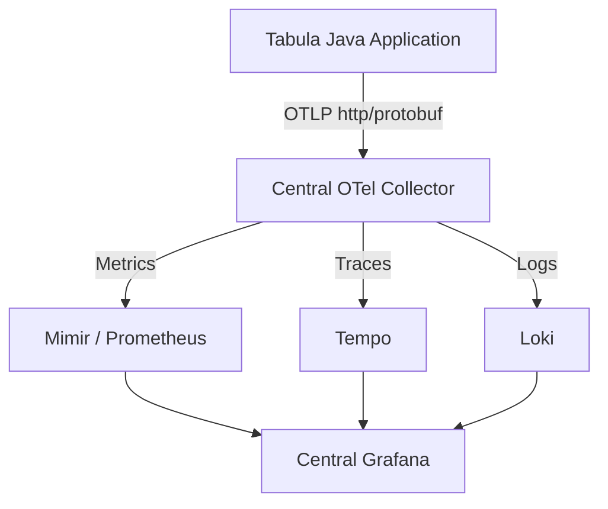

# OpenTelemetry Production Deployment Guide

This guide describes the configuration, instrumentation, deployment, and troubleshooting guidelines to integrate the Tabula project with the centralized observability backend (`https://otel.dsc.rodrigor.com`) using the OpenTelemetry Java Agent in production.

---

## 1. Architecture: Tabula Backend & Observability Stack

The Tabula backend is instrumented automatically (zero-code) via the **OpenTelemetry Java Agent** and manually with annotations. The telemetry data flows as follows:



All logs, traces, and metrics are sent securely to the centralized Grafana stack.

---

## 2. Docker & Infrastructure Integration

The Docker configuration has been unified to build via [Dockerfile](file:///c:/Users/cauab/Downloads/Tabula/docker/Dockerfile). 

During the Docker build process:
1. **Modular Agent Download**: The `agent-download` stage uses `ARG OTEL_AGENT_VERSION=2.5.0` to pull the fixed version of the OpenTelemetry Java Agent from GitHub.
2. **Binary Copy**: In the final stage, the agent binary is copied to `/app/opentelemetry-javaagent.jar`.
3. **Execution**: The agent is loaded at JVM startup using the `JAVA_TOOL_OPTIONS` environment variable.

---

## 3. Environment Variables Configuration

To configure OpenTelemetry in production, add the following variables to your local or server `.env` file. Do **not** use quotes around the values (especially for `OTEL_EXPORTER_OTLP_HEADERS`):

```env
# OpenTelemetry — Production Configuration
JAVA_TOOL_OPTIONS=-javaagent:/app/opentelemetry-javaagent.jar

OTEL_SERVICE_NAME=dsc-eq19
OTEL_EXPORTER_OTLP_ENDPOINT=https://otel.dsc.rodrigor.com
OTEL_EXPORTER_OTLP_PROTOCOL=http/protobuf
OTEL_EXPORTER_OTLP_HEADERS=Authorization=Bearer <TOKEN_FORNECIDO_PELO_PROFESSOR>

OTEL_TRACES_EXPORTER=otlp
OTEL_METRICS_EXPORTER=otlp
OTEL_LOGS_EXPORTER=otlp

# Enable capturing structured key-value pairs (KVP) in Logback
OTEL_INSTRUMENTATION_LOGBACK_APPENDER_ENABLED=true
OTEL_INSTRUMENTATION_LOGBACK_APPENDER_EXPERIMENTAL_CAPTURE_KEY_VALUE_PAIR_ATTRIBUTES=true
```

`service.name` permanece `dsc-eq19`. No build de produção, o GitHub Actions
passa `DEPLOYMENT_ENVIRONMENT=production` e `SERVICE_VERSION=${{ github.sha }}`
ao mesmo `docker/build-push-action` que publica a imagem. O Java Agent recebe:

```text
deployment.environment.name=production
service.version=<SHA exato do commit implantado>
```

O valor não depende de hostname ou URL: `github.sha` identifica o checkout
usado como contexto do build e acompanha a imagem efetivamente publicada.

> [!WARNING]
> Do **NOT** put double or single quotes around `OTEL_EXPORTER_OTLP_HEADERS` in the `.env` file, as doing so can corrupt the HTTP header value sent to the OTLP exporter, resulting in `401 Unauthorized` errors.

---

## 4. Privacy & Token Guidelines

To protect application and user data, the following rules must be strictly adhered to:
- **No Token Commits**: Never check in the `.env` file containing the production token or passwords. The versioned file is [.env.example](file:///c:/Users/cauab/Downloads/Tabula/.env.example).
- **Safe Examples**: Ensure `.env.example` contains only placeholders (e.g. `<TOKEN_FORNECIDO_PELO_PROFESSOR>`, `<SENHA_DO_BANCO>`).
- **No Sensitive Data Logging**:
  - Do **not** log user email addresses, names, verification codes, or SMTP passwords in logs (INFO or ERROR level).
  - Use `user_id` (the external UUID) for tracking and trace context correlation.
  - Do **not** log the complete JSON payloads of system state transfers in [StateController](file:///c:/Users/cauab/Downloads/Tabula/backend/src/main/java/br/com/tabula/controller/StateController.java).

---

## 5. Deployment Commands & Validation

### Rebuilding and Deploying

Execute the following commands from the root directory to rebuild and restart the containers:

```powershell
docker compose up -d --build --force-recreate
```

### Checking Logs and Verification

Verify that the Java Agent was successfully loaded by looking at the startup logs:

```powershell
docker compose logs tabula | Select-String "JAVA_TOOL_OPTIONS"
```

The output should show:
```text
Picked up JAVA_TOOL_OPTIONS: -javaagent:/app/opentelemetry-javaagent.jar
```

Ensure the variables are correctly loaded in the running container (without printing the header containing the secret token):

```powershell
docker compose exec tabula sh -c '
echo "$JAVA_TOOL_OPTIONS"
echo "$OTEL_SERVICE_NAME"
echo "$OTEL_EXPORTER_OTLP_ENDPOINT"
echo "$OTEL_EXPORTER_OTLP_PROTOCOL"
echo "$OTEL_TRACES_EXPORTER"
echo "$OTEL_METRICS_EXPORTER"
echo "$OTEL_LOGS_EXPORTER"
'
```

---

## 6. Grafana Explore Checks

Once traffic is generated (e.g. by logging in, registering, or running the database sync), open the centralized Grafana interface to verify telemetry signals:

### A. Traces (Tempo)
- In **Explore**, select **Tempo** as the data source.
- Query using `service.name = dsc-eq19 && deployment.environment.name = production`.
- Add `service.version = <SHA>` to isolate the exact deployed revision.
- Look for the manual span `@WithSpan("verify-user-email")` to verify user email flow.
- Look for the manual span `@WithSpan("sync-from-state-json")` to verify database synchronization.
- Inspect automatic spans like incoming HTTP endpoints (e.g. `POST /auth/login`) and outgoing JDBC spans representing database queries.

Local e produção continuam exportando para a mesma infraestrutura. Para o
ambiente local, troque o filtro por `deployment.environment.name = local`.
Nenhum resource attribute anterior do repositório foi removido: antes desta
mudança não havia `OTEL_RESOURCE_ATTRIBUTES` nos arquivos de execução.

### B. Logs (Loki)
- Select **Loki** as the data source.
- Run the query: `{service_name="dsc-eq19"}`.
- Verify that log statements include `trace_id` and `span_id` correlations.
- Expand a log to verify that structured fields (e.g. `user_id`, `operation`, `verification_result`, `users_synced`) are captured as indexable attributes.

### C. Metrics (Mimir / Prometheus)
- Select **Mimir** or **Prometheus** as the data source.
- Look for standard JVM metric prefix fields (e.g. `jvm_memory_used_bytes`, `jvm_threads_live_threads`, `process_cpu_usage`).
- Verify HTTP request metrics like `http.server.requests` to build request latency and response status code charts.

---

## 7. Troubleshooting & Resiliency

### Collector Downtime Resiliency
OpenTelemetry is designed to be completely decoupled. If the central collector (`https://otel.dsc.rodrigor.com`) is offline or if network timeouts occur:
- The Tabula backend will log export failures, but **remains fully functional**.
- Application requests, database writes, and business logic will **not** block or fail.

### 401 Unauthorized
If you see exporter error logs containing `Status{code=UNAUTHENTICATED, description=...}`:
- Check that the `OTEL_EXPORTER_OTLP_HEADERS` value in your server `.env` matches the correct token provided.
- Ensure the header is formatted exactly as `Authorization=Bearer <TOKEN>` without quotes.

### Connection Timeout
If you see exporter errors containing `deadline_exceeded` or connection refused:
- Verify network route and firewalls allow outgoing HTTPS traffic from your server to `otel.dsc.rodrigor.com` on port 443.

---

## 8. Data Retention Policies

To optimize storage space on the central observability cluster, the following retention limits are configured:
- **Traces**: 72 hours (3 days)
- **Logs**: 48 hours (2 days)
- **Metrics**: 7 days
